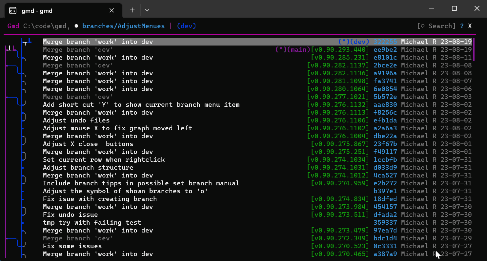

# gmd

Gmd is a cross-platform console UI Git client, which makes it easier to use Git, especially when using a branch model similar to e.g. GitFlow. Gmd makes it easy to toggle which branches to show and hide and simplifies using the most common git commands. It is like having dynamic squash, but without having to rewrite history to get clean history.

## Background

Usually, Git clients visualize the repository as an overwhelming number of branches, which makes the commits history difficult to understand. As a workaround, many developers simplify git history by squashing or rebasing.

Some clients try to reduce the branching complexity by hiding commits. The gmd approach is to make it possible to toggle which branches to show and which branches to hide. Thus a user can focus on tracking branches that really matter to them. For a developer, it might be to track just the main branch and the current working branch and for a team leader, it might be tracking main and a few selected features branches.

Gmd provides a user experience, where the visualization of branches and commits history is understandable and usable without the need for rebasing or squashing. Gmd also simplifies the usage of the most common commands by providing context menus and simplified dialogs. Gmd console window supports key-based navigation.

## Help File
The gmd [help file](https://github.com/michael-reichenauer/gmd/blob/main/gmd/doc/help.md) is available at:\
[https://github.com/michael-reichenauer/gmd/blob/main/gmd/doc/help.md](https://github.com/michael-reichenauer/gmd/blob/main/gmd/doc/help.md)

## Install
Download some version of `gmd_linux`, `gmd_windows` or `gmd_osx` and the run `> gmd --update` to get the latest version. For Windows it is easiest to just download the installer and run it. If you have gmd in a user folder, you do not need `sudo` to update. Gmd can automatically check for new versions and in the menu notify and offer option to upgrade.

#### Linux
`> curl -sS -L --create-dirs -o ~/gmd/gmd "https://github.com/michael-reichenauer/gmd/releases/latest/download/gmd_linux" && chmod +x ~/gmd/gmd`  
`> echo 'export PATH=$PATH:~/gmd' >>~/.profile`  
`> . ~/.profile`  

#### Windows:
Download setup file from [releases](https://github.com/michael-reichenauer/gmd/releases)  
or:  
`> curl -o gmdSetup.exe https://github.com/michael-reichenauer/gmd/releases/latest/download/gmdSetup.exe`  
`> gmdSetup`  

#### OSX/Mac
`> curl -sS -L --create-dirs -o ~/gmd/gmd "https://github.com/michael-reichenauer/gmd/releases/latest/download/gmd_osx" && chmod +x ~/gmd/gmd`  
`> echo 'export PATH=$PATH:~/gmd' >>~/.profile`  
`> . ~/.profile`  

## Run Sources with dotnet
`> dotnet run --project gmd/gmd.csproj`

## Build
Use build script:  
`> ./build`  
or:    
 `> Build.bat`

or use dotnet:  

#### Linux:  
`dotnet publish gmd/gmd.csproj -c Release -r linux-x64 -p:PublishReadyToRun=true --self-contained true -p:PublishSingleFile=true`  

#### Windows:  
`> dotnet publish gmd/gmd.csproj -c Release -r win-x64 -p:PublishReadyToRun=true --self-contained true -p:PublishSingleFile=true`  

#### OSX/Mac:  
`dotnet publish gmd/gmd.csproj -c Release -r osx-x64 -p:PublishReadyToRun=true --self-contained true -p:PublishSingleFile=true`

