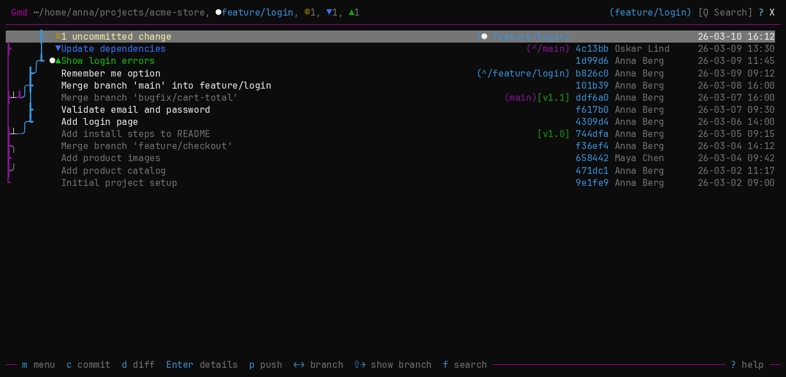

# Gmd

Gmd is a Git client for the terminal, on Linux, macOS and Windows. It draws your history as a
branch graph where **you choose which branches are shown**, so the log stays clean without
rebasing or squashing. The everyday Git commands are in menus and on single keys, so you don't
need to remember their syntax.


*Gmd in action.*

## Why Gmd

Most Git clients show every branch at once, and in a busy repository the log soon becomes a
tangle of lines. Teams often rebase or squash to keep it readable, which rewrites history.

Gmd leaves the history as it is and lets you choose what to look at. A developer may follow just
`main` and their own branch, while a team lead follows `main` and a few feature branches.
Showing or hiding a branch is instant and can be undone at any time. It works like a squash merge
that you can take back, and it never touches the history.

Git does not record which branch a commit was made on. Gmd works that out from the branch
structure and the merge messages, and draws each branch in its own column and color. When it
cannot tell, it marks the branch as ambiguous, and you can set it by hand.

## Features

- **Branch visibility**: show and hide branches, pick them from lists of recent, active, your
  own or deleted branches, and see markers where hidden branches merge in or branch out.
- **Side-by-side diff** of a commit, the uncommitted changes, a stash, or two branches. The
  context shown around the changes can be widened for one file at a time, up to the whole file.
- **Blame** that groups lines by the commit that last changed them and shades each commit by its
  age. You can step back to the version before a commit to get past a reformat or a rename.
- **Conflict resolver** for merges, rebases, cherry picks and reverts. It shows both sides next to
  each other, with the common ancestor at hand, and when you are done you can continue, skip or
  abort the operation.
- **Everyday Git without the syntax**: commit (with spell check), amend, push and pull (every
  shown branch at once if you like), merge in either direction, create, rename and delete
  branches, tags, stash, squash, cherry pick, undo and uncommit, file history, and search and
  filter.
- **Worktrees**: see every worktree of a repository and which ones have uncommitted changes, and
  open, add or remove them. This includes the worktrees Claude Code creates.
- **Keyboard and mouse**: every command is in a context menu, the common ones also have a
  single-key shortcut, and the mouse works for highlighting, menus and switching branches.
- **Works over SSH and in containers**: when no clipboard tool is available, gmd copies through
  the terminal instead (OSC 52), if the terminal supports it.
- **Keeps itself up to date** with a built-in update check and a one-click update.
- **Shared branch structure** (off by default, turned on per repository): the branch choices you
  make by hand can be pushed with the repository, so everyone sees the same graph.

## Getting Started

Start gmd in a folder of a Git repository:

```bash
cd my-repo
gmd
```

Started outside a repository, gmd opens a menu of your recent repositories, where you can also
browse to a repository, clone one or create a new one. `gmd -d <path>` opens the repository at
`<path>`, and `gmd --help` lists all the command-line options.

A few keys to start with:

| Key       | What it does                                              |
| --------- | --------------------------------------------------------- |
| `M`       | The menu of the highlighted branch or the current commit  |
| `←` `→`   | Highlight a branch in the graph                           |
| `Shift-→` | Choose which branches are shown                           |
| `Enter`   | Show or hide the commit details                           |
| `D`       | Diff of the commit                                        |
| `C`       | Commit                                                    |
| `?`       | Help, with every key and symbol                           |
| `Q`       | Quit                                                      |

The [help guide](gmd/doc/help.md) covers the rest, and gmd shows the same guide when you press
`?`.

## Installation

Gmd is one self-contained executable, so you don't need to install .NET. It does need `git` on
the `PATH`. Every release on the [releases page](https://github.com/michael-reichenauer/gmd/releases)
has these files:

| Platform              | File                                                  |
| --------------------- | ----------------------------------------------------- |
| Linux x64             | `gmd_linux_x64`                                       |
| Linux arm64           | `gmd_linux_arm64`                                     |
| macOS (Apple Silicon) | `gmd_osx_arm64`                                       |
| Windows x64           | `gmdSetup.exe` (installer), or `gmd_windows` (the executable) |

There is no release for Intel Macs. You don't need admin rights or `sudo` on any platform.

### Linux and macOS

This one command picks the right file for your OS and CPU:

```bash
curl -sL https://raw.githubusercontent.com/michael-reichenauer/gmd/main/install.sh | bash
```

It downloads gmd to `~/gmd/gmd` and adds `~/gmd` to the `PATH` in `~/.profile` (and on macOS in
`~/.zprofile` and `~/.bash_profile` as well). Then open a new terminal, or run `. ~/.profile`
(`. ~/.zprofile` on macOS).

To install by hand instead, use the file for your platform from the table above:

```bash
curl -sS -L --create-dirs -o ~/gmd/gmd https://github.com/michael-reichenauer/gmd/releases/latest/download/gmd_linux_x64
chmod +x ~/gmd/gmd
echo 'export PATH=$PATH:~/gmd' >> ~/.profile
. ~/.profile
```

On macOS, a file downloaded with a browser rather than `curl` is quarantined and will not start.
`xattr -d com.apple.quarantine ~/gmd/gmd` lifts that.

### Windows

Download and run `gmdSetup.exe` from the releases page, or from a terminal:

```powershell
curl.exe -L -o gmdSetup.exe https://github.com/michael-reichenauer/gmd/releases/latest/download/gmdSetup.exe
.\gmdSetup.exe
```

The installer downloads the latest gmd to `C:\ProgramData\gmd` and adds Start menu and desktop
shortcuts. To also start gmd from a terminal, open **Config ...** in the repo menu and tick **Add
gmd to PATH environment variable**. Without the installer, download `gmd_windows`, rename it to
`gmd.exe` and put it in a folder on your `PATH`.

### Updating

Gmd checks for new releases every hour and shows ⇓ in its top bar when there is one. Click it,
or pick **Update to Latest Version ...** at the top of the menu. From the command line, run:

```bash
gmd --update
```

The update replaces the executable where it is, so the folder must be writable by you. That is
why it needs no `sudo` when gmd is in your home folder. The **Config ...** dialog can turn the
update check off, update automatically, or allow preview releases, which are built from the
`dev` branch.

## Development

Gmd is written in C# for .NET 10 on [Terminal.Gui](https://github.com/gui-cs/Terminal.Gui) 1.x.
It runs the `git` command line for everything and uses no Git library. The code is layered, and
each layer calls only the one below it:

```text
gmd/Cui/                         Terminal.Gui views, dialogs, menus and the branch graph
gmd/Server/                      The repository model the UI shows, i.e. the branches you chose
gmd/Server/Private/Augmented/    Works out which branch each commit belongs to
gmd/Git/                         One service per area of git, each running the git command line
```

[CLAUDE.md](CLAUDE.md) describes the architecture, the conventions and the tests in depth. It is
written for Claude Code but is just as useful to read yourself. [MODERNIZATION.md](MODERNIZATION.md)
lists the open issues, and [USABILITY.md](USABILITY.md) is a review of the user experience with
proposals for improving it.

### Setting up

The easiest way is the devcontainer, locally in VS Code with Docker or in GitHub Codespaces. It
installs both .NET SDKs, and `./installtools` then adds the tools that the scripts and the
end-to-end tests use (tmux, lnav, the git hooks).

To set up a machine yourself you need:

- The **.NET 11 SDK**, a preview until .NET 11 is released and pinned in `global.json`. Its C# 15
  compiler is what the `Result` union type needs. [UPGRADING.md](UPGRADING.md) has the steps for
  when .NET 11 is released.
- The **.NET 10 runtime**, since gmd targets `net10.0` and the tests run on it.
- **git**, and **tmux** for the end-to-end tests.

### Scripts

| Script             | What it does                                                               |
| ------------------ | -------------------------------------------------------------------------- |
| `./run [args]`     | Run gmd from source                                                        |
| `./test`           | Run all tests (about 35 s); `--filter "TestCategory!=Integration"` runs only the fast ones (about 1 s) |
| `./build`          | Run the tests, audit the packages and publish the executables for every platform |
| `./build -l`       | The same, but publish only for Linux (x64 and arm64), which is much faster |
| `./log`            | Follow gmd's runtime log, `~/gmd.log`, in lnav                             |
| `./updatepackages` | List outdated NuGet packages (`-u` upgrades minor versions, `-m` major versions too) |
| `./installtools`   | Set up the devcontainer: tools, dotnet local tools and git hooks          |
| `./demo`           | Re-record the animation above, by running a scripted session in tmux     |

On Windows, `run.bat`, `build.bat` (`-w` builds Windows only) and `log.bat` do the same.

`./build` publishes each platform as a self-contained, single-file executable, for example:

```bash
dotnet publish gmd/gmd.csproj -c Release -r linux-x64 -p:PublishReadyToRun=true --self-contained true -p:PublishSingleFile=true
```

The executable ends up in `gmd/bin/Release/net10.0/<runtime>/publish/`. The runtimes released are
`linux-x64`, `linux-arm64`, `osx-arm64` and `win-x64`.

### Conventions

- **Formatting** belongs to [CSharpier](https://csharpier.com). A Debug build formats the code,
  and the pre-commit hook and CI check it. Don't format by hand.
- **Branches**: `main` holds the releases and `dev` the pre-releases, and CI publishes a GitHub
  release on every push to either one. Work on a feature branch and target `dev`.
- **Tests** go with every bug fix. The unit tests are in `gmdTest/`, laid out like `gmd/`, and the
  end-to-end tests, which drive the real executable in tmux, are in `gmdE2eTest/`.
- **`CHANGELOG.md` is generated** from the git history by `gmd --updatechangelog`, so don't edit
  it by hand.

## Third-party components

- [Terminal.Gui](https://github.com/gui-cs/Terminal.Gui) (MIT) is the console UI toolkit.
- [Autofac](https://github.com/autofac/Autofac) (MIT) handles dependency injection.
- [DiffPlex](https://github.com/mmanela/diffplex) (Apache 2.0) highlights the characters that
  changed within a line of the diff.
- [WeCantSpell.Hunspell](https://github.com/aarondandy/WeCantSpell.Hunspell) (MPL 2.0 / LGPL / GPL
  tri-license, used under MPL 2.0) is the managed Hunspell port that spell checks commit messages.
- The [SCOWL](http://wordlist.aspell.net) en_US Hunspell dictionary (MIT/BSD, see
  `gmd/doc/spelling/en_US.license`) is embedded in the executable.

## License

[MIT](LICENSE)
