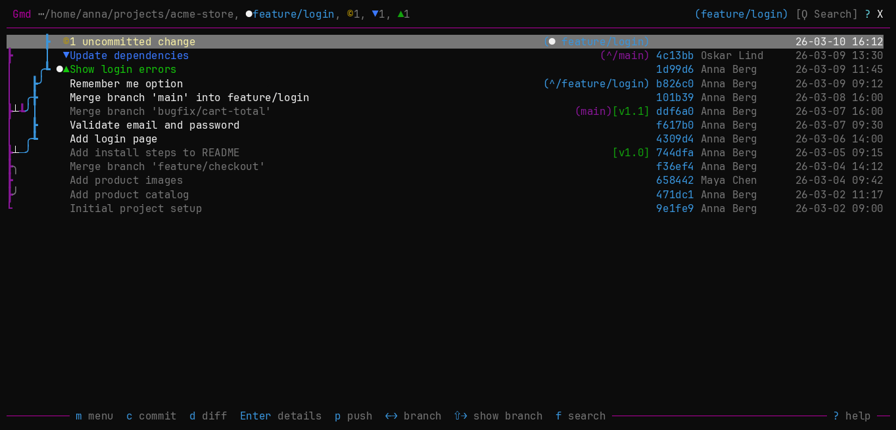

# Gmd

Gmd is a Git client for the terminal, on Linux, macOS and Windows. It draws your history as a
branch graph where **you choose which branches are shown**, so the log stays clean without
rebasing or squashing. The everyday Git commands are in menus and on single keys, so you don't
need to remember their syntax.


*Showing two hidden branches, one of them deleted long ago, a commit's diff, a search, then a
commit, a push and an update of every shown branch.*

## Why Gmd

Most Git clients show every branch at once, and in a busy repository the log soon becomes a
tangle of lines. Teams often rebase or squash to keep it readable, which rewrites history.

Gmd leaves the history as it is and lets you choose what to look at. A developer may follow just
`main` and their own branch, while a team lead follows `main` and a few feature branches.
Showing or hiding a branch is instant and can be undone at any time, with `Backspace`. It works like
a squash merge that you can take back, and it never touches the history.

Here is a small repository with five branches, and a sixth merged and deleted, as
`git log --graph --oneline --decorate --all` shows it:

```text
* 4c13bbd (origin/main) Update dependencies
| * 1d99d6a (HEAD -> feature/login) Show login errors
| * b826c09 (origin/feature/login) Remember me option
| *   101b39e Merge branch 'main' into feature/login
| |\
| |/
|/|
| * f617b05 Validate email and password
| * 4309d4b Add login page
| | * 83d45d5 (origin/feature/dark-mode, feature/dark-mode) Add theme toggle
| | * 09c5518 Add dark theme
| |/
|/|
* |   ddf6a02 (tag: v1.1, main) Merge branch 'bugfix/cart-total'
|\ \
| |/
|/|
| * beb669c (origin/bugfix/cart-total, bugfix/cart-total) Fix rounding of cart total
|/
| * 6fd3597 (origin/feature/search, feature/search) Highlight search matches
| * 6e028ff Search by category
| * 669997e Add search box
|/
* 744dfa8 (tag: v1.0) Add install steps to README
*   f36ef44 Merge branch 'feature/checkout'
|\
| * 5ca9760 Add checkout form
| * 2ecfa80 Add shopping cart
* | 6584425 Add product images
|/
* 471dc10 Add product catalog
* 9e1fe92 Initial project setup
```

And here as gmd first shows it, while you work on `feature/login`: your branch and `main`, each in
a column of its own, and the other branches hidden.

```text
      ┣  ©1 uncommitted change                    (● feature/login)
┣     ┃  ▼Update dependencies                              (^/main)
┃    ╭┺ ●▲Show login errors
┃   ┣╯    Remember me option                      (^/feature/login)
┃  ╭╊     Merge branch 'main' into feature/login
┣┴┺╯┃     Merge branch 'bugfix/cart-total'             (main)[v1.1]
┃   ┣     Validate email and password
┃  ╭┺     Add login page
┣┴─╯      Add install steps to README                        [v1.0]
┣╮        Merge branch 'feature/checkout'
┣         Add product images
┣╯        Add product catalog
┗         Initial project setup
```

Git does not record which branch a commit was made on. Gmd works that out from your reflog, the
merge messages and the branch structure, which is how `feature/checkout`, merged and deleted long
ago, still has commits of its own that can be shown. When it cannot tell, it marks the branch as
ambiguous, and you can set it by hand.

## Reading the Graph

In the picture above, and in color on the screen:

- **`main` runs down the left** (`┣`, down to `┗` for its first commit), and each branch has a
  column of its own to the right of the branch it was made from, here `feature/login`.
- **A branch and its copy on origin** are two columns side by side, origin's on the left: `▼`
  marks a commit to pull (`Update dependencies`, on `^/main`) and `▲` a commit to push
  (`Show login errors`). `^` is short for origin.
- **`●` is the commit you have checked out** and `(● feature/login)` the branch you are on.
  `©1 uncommitted change` is what you have not committed yet.
- **The thin lines between the columns** join a commit to a parent in another column: `╮` down to
  `╰` where a branch was merged into the one on its left, and `╭` down to `╯` where it was made
  from the one on its left, or had that one merged into it.
- **The dark marks beside `main`** (`┣╮`, `┣╯`, `┴`) are hidden branches merged in or made at
  that commit. A click there, or `←` to highlight `main` on that row and `Enter`, shows them, and
  `Shift-→` lists every branch to show.

The help, on the `?` key, starts with the same tour of the screen, including the top bar.

## Is Gmd for You?

Gmd works best when:

- Branches are **merged with merge commits**: git-flow, pull requests merged with a merge commit,
  long-lived release branches. Each merge records which branch came in, which is what keeps a
  branch's column after the branch itself is deleted. Gmd's own merges always make one.
- Many branches exist at once, your team's or your AI agents', and you want to follow a few.
- You work in a terminal, including over ssh and in containers.

It has less to show when every pull request is **squash merged or rebase merged**: `main` is then a
straight line, the branches leave nothing behind once deleted, and there is little to hide. Gmd is
still a complete terminal client there, just not a different one.

Known limits:

- A commit takes whole files: the commit dialog lists them, all ticked, to untick what is to be
  left out. There is no staging of single lines or hunks.
- Only the remote named `origin` is supported.
- The colors assume a dark terminal: on a light theme gmd is drawn on black.
- The log reads the latest 30,000 commits.
- Git's questions, a password, a passphrase or whether to trust a host, are asked in a dialog, but
  only for what you asked for: the fetch gmd runs in the background asks nothing, and says that `r`
  fetches and asks. An ssh older than OpenSSH 8.4 (2020) still asks on the terminal.

## Gmd and AI Coding Agents

Coding agents such as Claude Code work in branches and worktrees of their own, often several at
once. Gmd keeps that readable rather than letting it flood the log:

- ✦ in the top bar counts the hidden branches with something new, an agent's new branch included,
  and a click lists them, without showing them all.
- `w` lists the worktrees, which ones have uncommitted changes, which are in use by a running
  Claude Code session, and whose branches are merged. Open, add or remove them there.
- A branch checked out in another worktree is marked `⌂`, and `s` on it opens that worktree.
- When something goes wrong, **Undo** takes back the last change of a branch (a commit, a merge,
  a rebase, a reset), **Recover Lost Commits** finds the work a reset or a rebase left behind,
  and **Restore Deleted Branch** brings back a branch deleted by mistake.

## Features

**See what matters**

- **Branch visibility**: show and hide branches, pick them from lists of recent, active, your
  own or deleted branches or find one by typing part of its name, and see markers where hidden
  branches merge in or branch out, and a count of the hidden branches with something new since
  you last looked, new branches included.
- **Side-by-side diff** of a commit, the uncommitted changes, a stash, or two branches. The
  context shown around the changes can be widened for one file at a time, up to the whole file.
- **Blame** that groups lines by the commit that last changed them and shades each commit by its
  age. You can step back to the version before a commit to get past a reformat or a rename, or see
  every commit that changed the lines you select.
- **Search** of the messages, the changed files and the changes themselves, stepping through the
  matches in the log.
- **Diff any two commits**, wherever they are in the log.

**Do it without the syntax**

- **Everyday Git**: commit all the changes or the files you tick (with spell check), push and pull
  (every shown branch at once if you like), merge in either direction, create, rename and delete
  branches, tags (a list of them, to push or remove), stash, cherry pick, and file history.
- **Tidy up before you push**: amend any commit not pushed yet, with a new message or the changes
  you tick, drop one, or squash several, and Undo takes each back.
- **Conflict resolver** for merges, rebases, cherry picks and reverts. It shows both sides next to
  each other, with the common ancestor at hand, and when you are done you can continue, skip or
  abort the operation.
- **Worktrees**: see every worktree of a repository and which ones have uncommitted changes, and
  open, add or remove them.
- **Open in the browser**: a branch, a commit or the repository on GitHub, GitLab, Bitbucket, Azure
  DevOps or Gitea, or the page for a pull request into the branch the branch was made from.

**A way back**

- **Undo** the last change of a branch, whether it was made in gmd or not, and redo it.
- **Recover lost commits** that no branch has any more, and **restore deleted branches**.
- Commands that would throw work away ask first.

**Anywhere**

- **Keyboard and mouse**: every command is in a menu, the common ones also have a single-key
  shortcut, and the mouse works for highlighting, menus and switching branches.
- **Works over SSH and in containers**: when no clipboard tool is available, gmd copies through
  the terminal instead (OSC 52), if the terminal supports it, and a link it has no browser to open
  in is copied the same way.
- **Keeps itself up to date** with a built-in update check and a one-click update.
- **Shared branch structure** (off by default, turned on per repository): the branch choices you
  make by hand can be pushed with the repository, so everyone sees the same graph.

## Getting Started

Start gmd in a folder of a Git repository:

```bash
cd my-repo
gmd
```

Started outside a repository, gmd opens a menu of your recent repositories, where you can also
browse to a repository, clone one or create a new one. `gmd -d <path>` opens the repository at
`<path>`, and `gmd --help` lists all the command-line options.

Your first five minutes:

1. The log shows `main` and the branch you are on. The dark marks beside `main` are the hidden
   branches.
2. `Shift-→` and type part of a branch's name to show it. `Backspace` takes it back.
3. `←` and `→` highlight a branch, and `m` opens its menu, which has every command and its key.
4. `d` shows the diff of a commit, `c` commits and `p` pushes.
5. `?` opens the help, which starts with how to read the screen.

A few keys to start with:

| Key       | What it does                                              |
| --------- | --------------------------------------------------------- |
| `m`       | The menu of the highlighted branch or the current commit  |
| `←` `→`   | Highlight a branch in the graph                           |
| `Shift-→` | Choose which branches are shown                           |
| `Enter`   | Show or hide the commit details                           |
| `d`       | Diff of the commit                                        |
| `c`       | Commit                                                    |
| `?`       | Help, with every key and symbol                           |
| `q`       | Quit                                                      |

The line at the bottom of the screen shows the keys that do something where the cursor is, and
changes as it moves. The [help guide](gmd/doc/help.md) covers the rest, and gmd shows the same guide
when you press `?`.

## Installation

Gmd is one self-contained executable, so you don't need to install .NET. It does need `git` on
the `PATH`, and a terminal with a dark theme and a font with box-drawing characters, which most
have. Every release on the [releases page](https://github.com/michael-reichenauer/gmd/releases)
has these files:

| Platform              | File                                                  |
| --------------------- | ----------------------------------------------------- |
| Linux x64             | `gmd_linux_x64`                                       |
| Linux arm64           | `gmd_linux_arm64`                                     |
| macOS (Apple Silicon) | `gmd_osx_arm64`                                       |
| Windows x64           | `gmdSetup.exe` (installer), or `gmd_windows` (the executable) |

There is no release for Intel Macs. You don't need admin rights or `sudo` on any platform.

### Linux and macOS

This one command picks the right file for your OS and CPU:

```bash
curl -sL https://raw.githubusercontent.com/michael-reichenauer/gmd/main/install.sh | bash
```

It downloads gmd to `~/gmd/gmd` and adds `~/gmd` to the `PATH` in `~/.profile` (and on macOS in
`~/.zprofile` and `~/.bash_profile` as well). Then open a new terminal, or run `. ~/.profile`
(`. ~/.zprofile` on macOS).

To install by hand instead, use the file for your platform from the table above:

```bash
curl -sS -L --create-dirs -o ~/gmd/gmd https://github.com/michael-reichenauer/gmd/releases/latest/download/gmd_linux_x64
chmod +x ~/gmd/gmd
echo 'export PATH=$PATH:~/gmd' >> ~/.profile
. ~/.profile
```

On macOS, a file downloaded with a browser rather than `curl` is quarantined and will not start.
`xattr -d com.apple.quarantine ~/gmd/gmd` lifts that.

### Windows

Download and run `gmdSetup.exe` from the releases page, or from a terminal:

```powershell
curl.exe -L -o gmdSetup.exe https://github.com/michael-reichenauer/gmd/releases/latest/download/gmdSetup.exe
.\gmdSetup.exe
```

The installer downloads the latest gmd to `C:\ProgramData\gmd` and adds Start menu and desktop
shortcuts. To also start gmd from a terminal, open **Config ...** in the repo menu and tick **Add
gmd to PATH environment variable**. Without the installer, download `gmd_windows`, rename it to
`gmd.exe` and put it in a folder on your `PATH`.

### Updating

Gmd checks for new releases every hour and shows ⇓ in its top bar when there is one. Click it,
or pick **Update to Latest Version** at the top of the menu. From the command line, run:

```bash
gmd --update
```

The update replaces the executable where it is, so the folder must be writable by you. That is
why it needs no `sudo` when gmd is in your home folder. The **Config ...** dialog can turn the
update check off, update automatically, or allow preview releases, which are built from the
`dev` branch.

## What Gmd Stores and Sends

- `~/.gmdconfig`: your settings and recent repositories.
- `.gmdconfig` in each repository's `.git` folder: which branches are shown, their colors and
  their order.
- `refs/gmd-metadata-key-value/data` in a repository: the branches you set by hand, and what your
  reflog says about where commits were made, kept for when the reflog has expired. It is pushed
  to origin only when the shared branch structure is turned on.
- `~/gmd.log`: a log of what gmd does, started afresh each time it runs.

Over the network, gmd runs git's own fetches and pushes to origin (a fetch every five minutes, to
keep the ▼ counts current), and asks GitHub for the latest release every hour, which **Config ...**
turns off. Nothing else is sent: there is no telemetry.

## Problems and Feedback

Report a problem, or suggest something, in the
[issues](https://github.com/michael-reichenauer/gmd/issues), with the version from **About** in the
repo menu or from `gmd --version`. `~/gmd.log` is the first place to look when something goes
wrong; **About** shows where it is, and if gmd itself fails, it says so when it ends, with the same
links. The log is begun anew on every start, so copy it before starting gmd again.

## Contributing

[CONTRIBUTING.md](CONTRIBUTING.md) describes how gmd is built, how to set up a machine for it, the
scripts and the conventions.

## Third-party components

- [Terminal.Gui](https://github.com/gui-cs/Terminal.Gui) (MIT) is the console UI toolkit.
- [Autofac](https://github.com/autofac/Autofac) (MIT) handles dependency injection.
- [DiffPlex](https://github.com/mmanela/diffplex) (Apache 2.0) highlights the characters that
  changed within a line of the diff.
- [WeCantSpell.Hunspell](https://github.com/aarondandy/WeCantSpell.Hunspell) (MPL 2.0 / LGPL / GPL
  tri-license, used under MPL 2.0) is the managed Hunspell port that spell checks commit messages.
- The [SCOWL](http://wordlist.aspell.net) en_US Hunspell dictionary (MIT/BSD, see
  `gmd/doc/spelling/en_US.license`) is embedded in the executable.

## License

[MIT](LICENSE)
